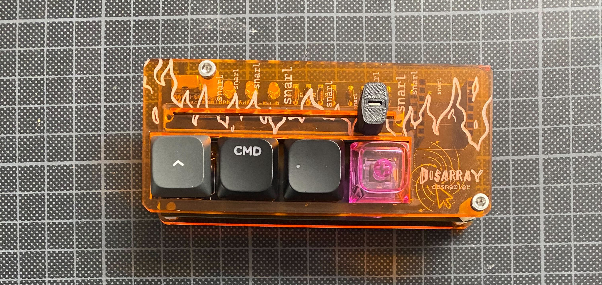

### Great! you finished soldering!

### so let's go ahead and flash some firmware onto your Desnarler!
If you are in a workshop with us, we will help you and flash the first round with you, or you even got an already flashed microcontroller.

If you feel comfortable with the terminal and an IDE of your choice: This guide is for you.



# Prepare: Install QMK

This is just a quick recap. If you get stuck, check the official qmk documentation [here](https://docs.qmk.fm/newbs_getting_started)

In order to get QMK installed on your system run
```bash
python3 -m pip install qmk
```

Test if installation was successfull:
```bash
qmk --version
```


# Flash Desnarler

Clone this [repo](https://github.com/ZenVega/qmk_for_macropad/tree/main) containing the firmware and the macropad layout and keymap.

To install all missing dependencies run:

```bash
git submodule update --init --recursive

git submodule sync --recursive
git submodule update --init --recursive --force
```
## Chose Keymap
We provide a few different keymaps, that we think will be useful to you.
When you look around in the repo you just cloned, there is a directory "keyboards". Within this choose the directory corresponding to the keyboard you have - in your case it is a DesnarlerV1. Within this directory there are different keymaps to configure what your Desnarler does.

### default keymap
The default keymap allows you to navigate through Workspaces on Linux, if the Switch on the top left of the Desnarler is to the left. And does the same thing on MacOS if the switch is to the right.

- The 2 most right keys will navigate workspaces without dragging your current window.
- Pressing the left most key plus one of the right most keys will navigate through workspaces while dragging the current window along. 
- Pressing the second key to the left will activate the 2 right keys to circle through all the open applications 
- holding the 2 right most keys and pressing any of the other 2 will put your system to sleep

### default_pure_linux keymap
As the name says, this keymap should be used on a Linux OS.
There are two independent sets of layouts.

If the switch on the top left of the Desnarler is to the left it will behave as the default keymap and help you navigate through workspaces and open apllications.

If the switch it to the right, the focus is on rearranging the windows within a workspace
- the 2 left most keys will move the currently active windows to the left or right half of the screen.
- having activated the left most key, the 2 keys on the right will maximize and minimize the current window
- holding the second key to the left will let you switch workspaces without dragging the current window

## Compile
After you have chosen your preferred keymap, you are ready to compile.

Compilation will create a \*.bin that holds the firmware including your compilation ready to be flashed on the MCU

```bash
qmk compile -kb <keyboard> -km <keymap>
```

so a likely use will be

```bash
qmk compile -kb desnarler_v1 -km default_pure_linux
```

If no keyboard is defined, your keymap is 'default'. 

### Flash
After compilation you are ready to flash qmk to your microcontroller (rp2040 in this case): plug it in and set it into bootloader mode. 
This requires pressing the boot button while plugging it in. The device should show up as a flashable media in your files-explorer.
run:

```bash
qmk flash -kb <keyboard> -km <keymap>
```

so likely you will use
```bash
qmk compile -kb desnarler_v1 -km default_pure_linux
```


#### Troubleshooting Flashing

If your have done minor changes to your firmware, flashed and everything seemed fine, but the old firmware is still booting, download this [nuke file](https://datasheets.raspberrypi.com/soft/flash_nuke.uf2). Once downloaded, copy it onto your RP2040 while in bootloader mode. This will erase all traces of the former firmware. Then just flash again.