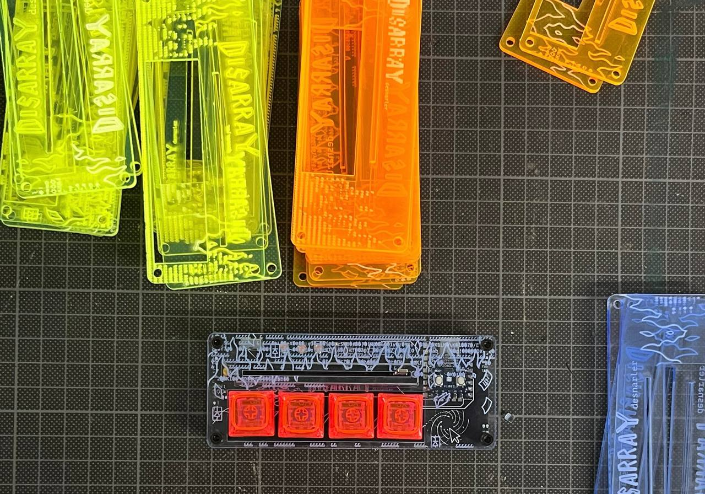
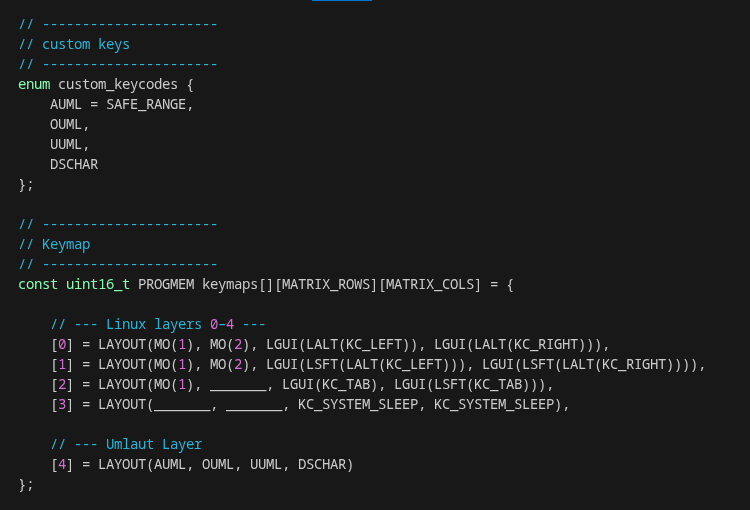
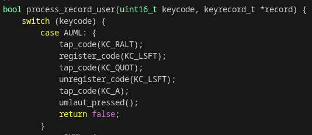

# The Umlaut map – using a bit more complex features of qmk



### general idea and neccesary settings
If you want to type to type the German Umlaute Ä, Ö and Ü on a regular QWERTY keyboard, you will have to use [compose keys](https://en.wikipedia.org/wiki/Compose_key).
To get to ä you would use 
1) Compose 
2) Shift and “  
3) a

For this to work you need to locally set your custom compose key. An option, that is regularly used, is to have compose on the right ctrl. To set this (which is also necessary to use the Umlaute from the Umlauts keymap in the repo) you have to define the Compose key within the keyboard settings (that is at least true for Linux systems).

### peak into the code
After having set this, lets look at the code to procude an ä with our tiny Desnarler. We do create an enum of macro for all the Umlaute, we want to be able to use. 

These Macros are then called as keys within layout 4, while Layouts 0-3 remain as we know them from the default keymap.



Because we are not calling a specific key or a simultaneous press of keys at the same time, we need to do things differently for layout 4.
For our purposes we use a function, that QMK offers:

```
bool process_record_user(uint16_t keycode, keyrecord_t *record) 
```
This function is called everytime a key is pressed or released and therefore is just the right spot for us to handle our custom Umlaut keys.

Let's look at AUML as an example:



In case we pressed the key, that we labeld AUML in the Layout it's case will be called in this switch statement. Then we will tap (imitating one short keypress) our compose key, which is set to right Alt. Then we need to hold left shift while pressing "/'. So we register left shift and press " before we unregister (let go of) left shift. This sequence is the same for all Umlaute. As we want Ä in this example, we tap KC_A and we are done. (the umlaut_pressed function handles the LEDs on key press here).

You can learn more about functions that for instance get called once on boot of our custom keyboard or are a constant running loop [here](https://docs.qmk.fm/custom_quantum_functions).

### other ideas / lessons learned
... we had, or you potentially have - is there an easier / less long approach to this? and lessons learned on the way towards an Umlaut keymap:
- QMK does not support Unicode. So sending the Unicode of the Umlaute is not possible. Only ascii characters are accepted
- it is possible to send strings (using send_string(char *str)). But well, ascii strings.
- there are language specific headers! won't they support sending unusual character? - nope, they just provide provides language-specific keycode aliases - this would only be useful if your normal keyboard is not set to be read as US ANSI but say German - but then there would also be no need for a seperate keyboard option to produce 'Ä'

#### options for the Umlaut map
- the current Umlaut map does not support capital Umlaute. The code for this is there. But there are just 4 keys. So if you want to have ß, we are lacking a key for Capitalisation
- is there not an option to double use one physical key? there is! it would be using 
```
LT(layer selected on hold, key pressed on tap)
```
but: this does not work for "invented" keys as our AUML


### Contribute!
This for now and for our current investigation results.

If you have more ideas for useful keymaps or want to share and show us how you are using your Desnarler: create a pull request 

loads of love - the DesktopOrdnungsamt


