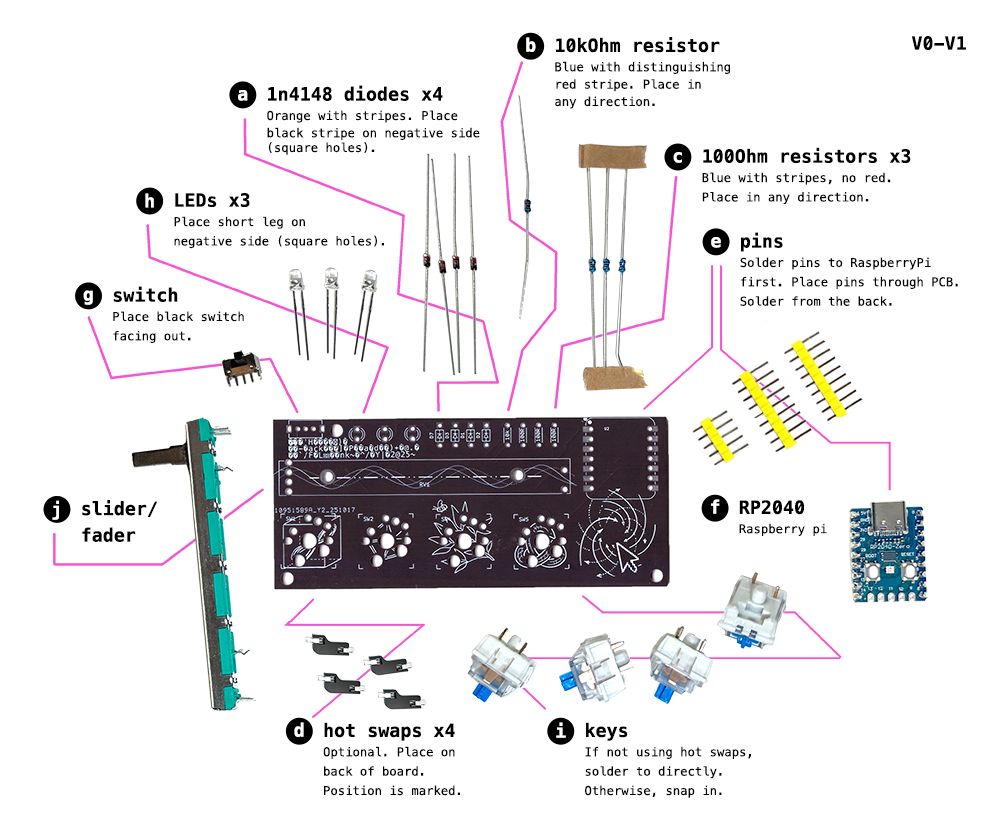

# DisArray Desnaler

Congrats on getting your first own DisArray Desnarler. We are happy to have you here and help you to organise your Desktop

For a quick read of the project, have a peak in [this hackaday article](https://hackaday.io/project/204536-disarray-desnarler)

your Schreibtischordnungsdienst

## Soldering instructions

[](./path/to/file.pdf)

## Installation

### Prepare: Install QMK

This is just a quick recap. When you get stuck, check the official qmk documentation [here](https://docs.qmk.fm/newbs_getting_started)

In order to get QMK installed on your system run
'python3 -m pip install qmk'
Test if installation was successfull:
'qmk --version'

If you want to start from scratch look further down for [general instructions](#qmk-setup).
In case you just want to flash your macropad: stay here.

### Flash Desnarler

If you want to work with the layout we provide clone this [repo](https://github.com/ZenVega/qmk_for_macropad/tree/main) containing the firmware and the macropad layout and keymap.

(Alternatively you use the cloned firmware and copy/paste the all keyboard config files in the equivalent folder.)

To install all missing dependencies run:

```bash
git submodule update --init --recursive

git submodule sync --recursive
git submodule update --init --recursive --force
```

### Compile

This will create a \*.bin that holds the firmware including your compilation ready to be flashed on the MCU

```bash
qmk compile -kb <keyboard> -km <keymap>
```

you should find a <your_keyboard>

If no keyboard is defined, your keymap is 'default'. Have a look around the keymaps we provided.

### Flash

Once you are ready to flash qmk to your microcontroller (rp2040 in this case), plug it in and set it into bootloader mode.
In our case that requires pressing the boot button while plugging it in. The device should show up as a flashable media in your files-explorer.
run:

```bash
qmk flash -kb <keyboard> -km <keymap>
```

#### Troubleshooting Flashing

If your have done minor changes to your firmware, flashed and everything seemed fine, but the old firmware is still booting, download this [link](https://datasheets.raspberrypi.com/soft/flash_nuke.uf2). Once downloaded, copy it onto your RP2040 and just flash again.

### Changing the Keymap

you will find more information here soon about how to change the keymaps easily.
O course you can consult the QMK documentation at any time.

## QMK Setup

```bash
qmk setup
```

Will install the qmk firmware
submit prompts with 'y'

You should now have QMK setup in '~/qmk_firmware'.

### Create new layout

```bash
cd ~/qmk_firmware/keyboards
qmk new-keyboard
```

follow the instructions. when it comes to the board, choose:

->non of the above layouts

->15. promicro_rp2040

your new keyboard's setup should now be created in:

```bash
~/qmk_firmware/keyboards/<your_keyboards_name_folder>
```


in you keyboard.json:
add:

```yaml
"via": true
```

to the features

add:

```yaml
  "analog": {
    "pins": ["GP26"]
  },
```

This adds the potential use of variable resistors connected to pin26.

The 'keyboard.yaml' holds the actual layout of the keyboard as well as some more metadata.
You may have multiple keymaps holding different configurations for this layout.
After configuring your keymap to your liking, you can always try to compile and see if you keymap.c and you kayboard.yaml align:
