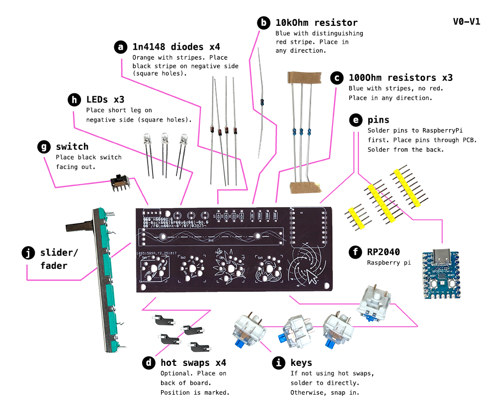

# DisArray Desnaler

Congrats on getting your first own DisArray Desnarler. We are happy to have you here and help you to organise your Desktop

For a quick read of the project, have a peak in [this hackaday article](https://hackaday.io/project/204536-disarray-desnarler)

your Schreibtischordnungsdienst

## Soldering instructions

### Flashing your Desnarler

After you are done soldering, it is time to flash your Desnarler with some firmware to make it ready for use. Let's first use a keymap we provide you.

For this please refer to the [How_to_flash](./How_to_flash.md).

If your are further interested in configuring the Desnarler yourself see [How_to_configure](./How_to_configure.md).

