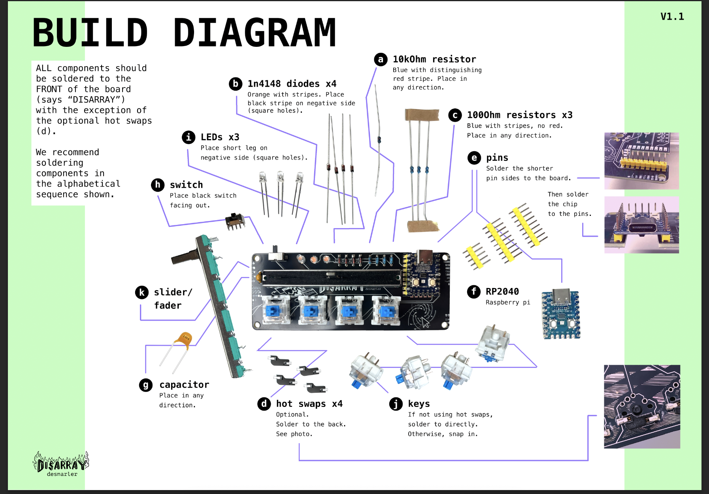

# DisArray Desnarler

Congrats on getting your first own DisArray Desnarler. We are happy to have you here and help you organise your desktop.

For a quick overview of the project, have a look at [the Hackaday project page](https://hackaday.io/project/204536-disarray-desnarler).

[](./images/desnarler.jpg)

&mdash; _your Schreibtischordnungsdienst_

## What's in this folder

```
pcb/v1.1/        current PCB — KiCad project, gerbers and BOM.md
pcb/v0.5/        earlier PCB revision (archived)
instructions/    configuration and Umlaut guides (flashing guide is shared, see ../instructions/)
case/            laser-cut case (current_version/ + old_version/)
build_guide/     assembly build diagram
3d_prints/       fader knob STL
logo/            logo and sticker artwork
images/          photos and diagrams
artwork/         PCB silkscreen / mask vector art
```

The shared KiCad symbol and footprint libraries live at the repository root in [`../symbols_and_footprints/`](../symbols_and_footprints/).

## Soldering instructions

The PCBs are sponsored by [PCBWay](https://www.pcbway.com/). Thanks for the support. Check out their services for high-quality PCBs and fast service.

All components should be soldered to the front of the board, with the exception of the optional hotswap sockets (d).

The alphabetical markers in this diagram show the recommended soldering order, based on the height of the components. Note that while "a" through "c" are next to each other in the diagram, the rest of the sequence is scattered. Be careful not to simply go clockwise.

[](./instructions/build_guide/build_diagram_v1_1.png)

The full bill of materials is in [`pcb/v1.1/BOM.md`](./pcb/v1.1/BOM.md).

### Using the Desnarler as a Macropad

After you are done soldering, it is time to flash your Desnarler with some QMK firmware to make it ready for use. Let's start with a keymap we provide.

For this, please refer to the [How_to_flash](../instructions/How_to_flash.md) guide.

If you are interested in configuring the Desnarler yourself, see [How_to_configure](./instructions/How_to_configure.md).

If you are looking for an option to change the meaning of the keys a bit more easily check out the [Companion App](https://github.com/ZenVega/qmk_disarray_desnarler/blob/main/companion-app/README.md) (works with MacOS only).

### What you can also do

You can also use your Desnarler to play [Vimchaser!](https://github.com/uschi909/vimchaser)
