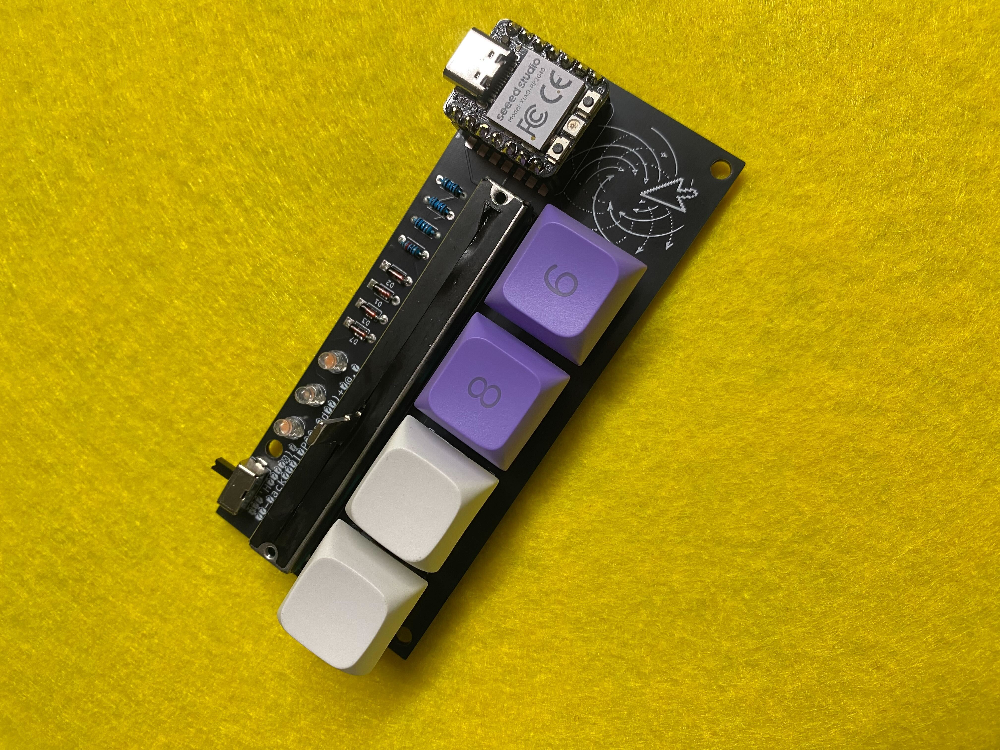
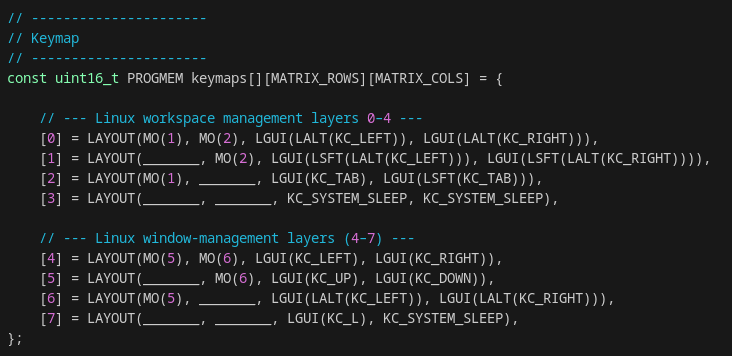

# How to configure the keymap yourself



To give you an easy introduction into how you can configure your Desnarler according to your needs, lets have a closer look into what is happening within the code of the keymaps. This will help you to figure out how to create a keymap yourself.

If you ever get stuck here, the reference will be the [official QMK documentation](https://docs.qmk.fm/newbs_getting_started)

If you feel comfortable with coding: this is just an easy intro for people less comfortable to change the Desnarler according to their needs. It might still be a good start for you as well, but of course you are free to look at the whole code to also get into the LEDs and the slider.

## The keymaps we provide

We provide a few different keymaps, that we think will be useful to you. Within the `desnarler_v1` keyboard directory of the [firmware repo](https://github.com/ZenVega/qmk_disarray_desnarler) there are different keymaps to configure what your Desnarler does.

### default keymap

As the name says, this keymap should be used on a Linux OS.
There are two independent sets of layouts.

If the switch on the top left of the Desnarler is to the left:

- The 2 most right keys will navigate workspaces without dragging your current window.
- Pressing the left most key plus one of the right most keys will navigate through workspaces while dragging the current window along.
- Pressing the second key to the left will activate the 2 right keys to circle through all the open applications
- holding the 2 right most keys and pressing one of the other 2 will log you out or put your system to sleep

If the switch it to the right, the focus is on rearranging the windows within a workspace

- the 2 left most keys will move the currently active windows to the left or right half of the screen.
- having activated the left most key, the 2 keys on the right will maximize and minimize the current window
- holding the second key to the left will let you switch workspaces without dragging the current window
- holding the 2 right most keys and pressing one of the other 2 will log you out or put your system to sleep

### German Umlaute ä, ö, ü

This keymap has the German Umlaute on the second set of layers (switch to the right), including the option to get the capital Umlaute. More thoughts on this map and a slightly deeper dive into QMK [here](./How_to_Umlaut.md)

## A closer look into the keymaps

### an easy example

A big part of using QMK to customize any keyboard according to your needs is to be able to set the layout. This is happening within the keymap.c - file whhere you configure how your keyboard will behave.
In the [QMK documentation](https://docs.qmk.fm/) you will find big tables where you can figure out the names of all the keys you could potentially press [here](https://docs.qmk.fm/keycodes_basic).

Lets say you want to use just a single layout, where the keys are the keys A, B, 1, 2.
Then the layout would be
```bash
[0] = LAYOUT(KC_A, KC_B, KC_1, KC_2)
```
pretty easy to see why, isn't it?

### default_pure_linux


Let us dive into the default keymap we provide and learn about the use of the modifier keys.

As you can see this code provides 8 different layouts to give the keys of your keyboard meaning.

The layouts are grouped into 2 groups, representing the whether the switch on the top left of the Desnarler is to the left (Layout 0-3) or to the right (Layouts 4-7). This is set up for you in another part of code - you don't need to worry about this.

For understanding it is important to realise that you will always fall back onto layout 0 or 4 respectively and this is also the default layout that is "on", when no key is pressed.

the 4 keys in layout 0:

- the first key MO(1) will change the layout to Layout 1 while held, just as MO(2) on the second key will change to Layout 2
- the third key will send the keys left GUI (also called Super or OS key), left Alt and the left arrow key at the same time
- just like the fourth key will send the keys left GUI - left Alt and the right arrow key at the same time

What you see in this example is how you can send multiple keys at the same time, if some of them are modifier keys. In easy words a modifier key is a key on your normal keyboard that changes the layout of your keyboard, when pressed. For instance to reach the layout that contains all the capital letters you hold the Shift key. So KC_A will write 'a' while LSFT(KC_A) will write 'A'. A list of the names of the Modifier Keys and the way to use them within QMK is [here](https://docs.qmk.fm/feature_advanced_keycodes).

Within the layouts of the default map, Desnarler acts as if the keys "pressed at the same time". For an example, where a keypress of the Desnarler leads to a series of keypress signals being send, habe a look in [How_to_Umlaut.md](./How_to_Umlaut.md).

We hope this helps as an introduction on how to configure your Desnarler just the way you need it. 

## Done creating your own keymap?
Then go ahead and flash it onto the Desnarler as described [here](../../instructions/How_to_flash.md)