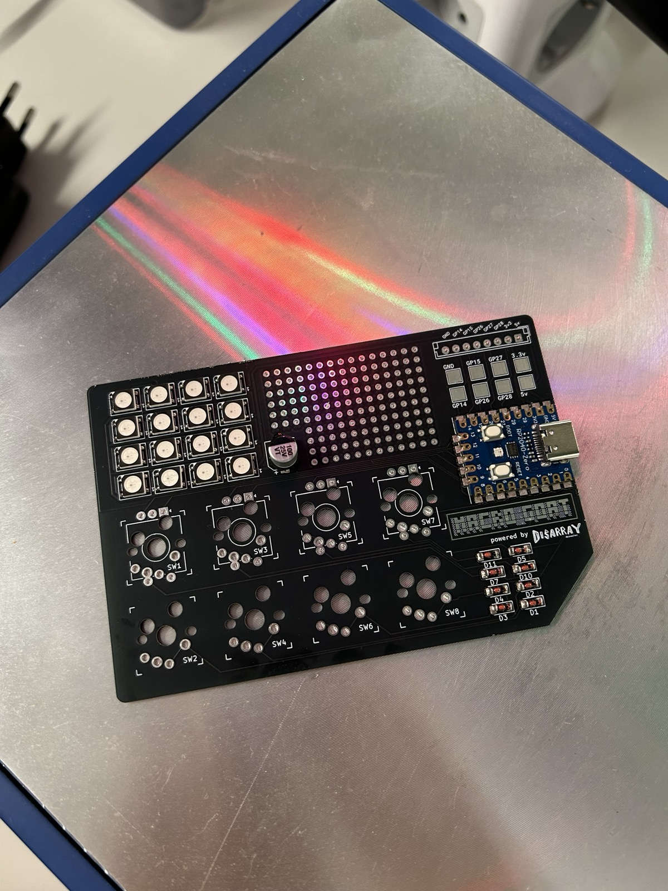
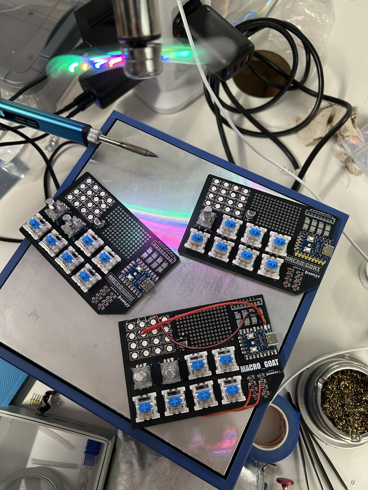

# macro_GOAT

A custom macropad built around an RP2040-Zero with a 16-LED WS2812B array, hot-swap
switches, and up to 4 optional EC11 rotary encoder.




🎬 [Watch the demo video](./images/GOAT_demo.mp4)

## What's in this folder

```
pcb/v1.0/        KiCad project, gerbers, SMD stencil and BOM.md
  gerbers/         fabrication gerbers (+ stencil/ for the SMD stencil)
  chaos_array.*    KiCad schematic / board / project files
  smd_stencil.svg  stencil artwork
  BOM.md           bill of materials
artwork/         board graphics — the macro_GOAT logo studies and silkscreen text
images/          build photos and demo video
```

> The KiCad project files are still named `chaos_array.*` (the board's original name).
> The shared KiCad symbol and footprint libraries live at the repository root in
> [`../symbols_and_footprints/`](../symbols_and_footprints/); the project's
> `fp-lib-table` / `sym-lib-table` may need re-pointing there when opening in KiCad.

## Bill of materials

See [`pcb/v1.0/BOM.md`](./pcb/v1.0/BOM.md).

## Firmware

The macro_GOAT keymap lives in the shared QMK repository
[ZenVega/qmk_disarray_desnarler](https://github.com/ZenVega/qmk_disarray_desnarler)
(alongside the DisArray Desnarler keymap). Flash it with QMK using the shared
[flashing guide](../instructions/How_to_flash.md).
